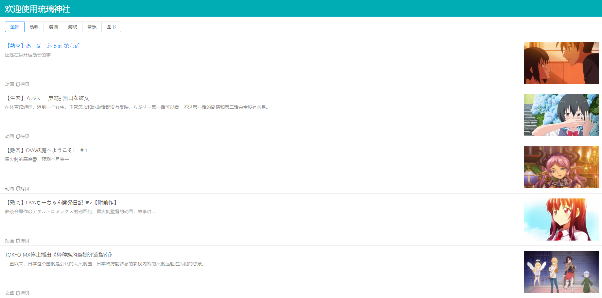

# 琉璃神社爬虫
[](https://github.com/dwyl/esta/issues)


## 直接使用
```
docker pull alanlang/liuliget-go:latest
```

## 下载运行
下载
```
git clone git@github.com:AlanLang/liuliget.git
```
## 开发前端

安装依赖
```
npm install
```

运行
```
npm start
```

## 编译
编译前端
```
yarn build
```

编译后端
```
go build -o liuliget
```
## docker部署
根据docker环境编译go
```
CGO_ENABLED=0 GOOS=linux GOARCH=amd64 go build -ldflags "-s -w" -o liuliget
```
构建镜像
```
docker build -t liuliget .
```
运行容器
```
docker run -itd --name liuliget --restart=always -p 8101:8080 liuliget
```

或者使用docker-compose
```
docker-compose up -d
